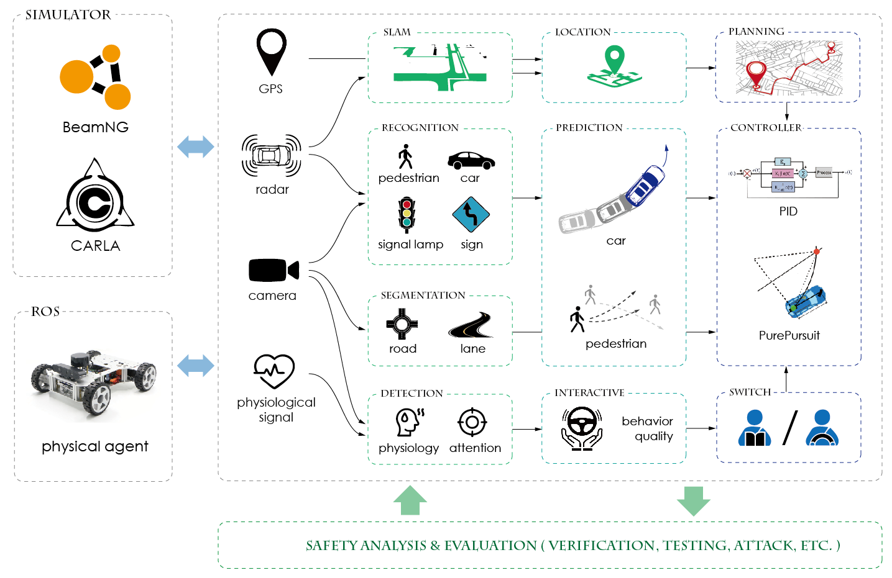

# ISS

Intelligent Self-driving System (ISS) is a modular framework written in Python and C++. The aim for this framework is to build a extensible framework for research propose. This framework will contain both classic and deep learning algorithms for self-driving tasks such as perception, localization, mapping, prediction, planning and control. The modular design with minimal external library can provide a transparent and clean workspace for researchers to evaluate ADS alogirhtms.

{: .center-image }

*ISS Architecture*
{: .text-center}

## Simulator Demos
At present, the ISS has the capability to deploy and test algorithms using simulator data. Upon integrating sensor data from the CARLA simulator into our framework, we can evaluate a range of algorithms. Additionally, corresponding control algorithms can be employed to maneuver simulated vehicles. Here are some demonstrations.

<video width="640" height="360" controls>
  <source src="assets/following_1.mp4" type="video/mp4">
</video>
{: .center-image }

A real-time demonstration of the PointPillar 3D detection algorithm within the Carla simulator
{: .text-center}

<video width="640" height="360" controls>
  <source src="assets/local_planning.mp4" type="video/mp4">
</video>
{: .center-image }

A demo showing the local behavior planning 
{: .text-center}

## Minicar Demos
In addition to simulation results, if the sensor data from the minicar is transmitted back to the ISS via ROS, the ISS can leverage the sensory data to accomplish a variety of tasks and exert control over the physical minicar. We also provide some demonstrations as follow.

<video width="640" height="360" controls>
  <source src="assets/nav_indoor_small.mp4" type="video/mp4">
</video>
{: .center-image }

<video width="640" height="360" controls>
  <source src="assets/nav_outdoor_small.mp4" type="video/mp4">
</video>
{: .center-image }

Two demos featuring physical minicars navigating indoor and outdoor environments, respectively
{: .text-center}

<video width="640" height="360" controls>
  <source src="assets/localization_aloam_small.mp4" type="video/mp4">
</video>
{: .center-image }

A demo showcasing the A-LOAM SLAM algorithm using data from physical minicars
{: .text-center}

<!-- ## Our Works

Currently, we have leveraged components of the ISS for various tasks, including scene construction, autonomous driving safety verification, and adversarial attacks on perception models.

<video width="640" height="360" controls>
  <source src="assets/LeftCutInSmall.mp4" type="video/mp4">
</video>
{: .center-image }
A simple left cut-in scenario built
{: .text-center} -->