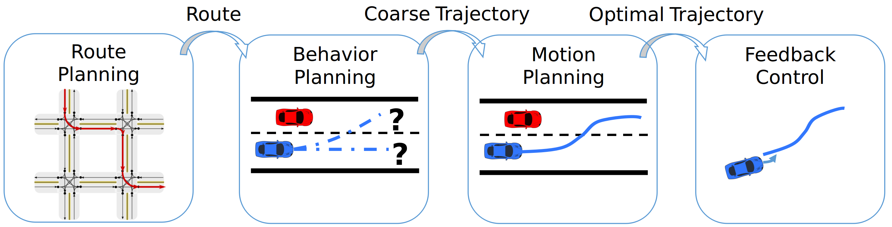

# Planning

## Introduction to the Planning Module
The autonomous driving pipeline encompasses a multitude of components, from perception to control. 
Central to this pipeline is the "Planning module", responsible for making strategic and tactical decisions about the vehicle's movement. 
This module breaks down into three key stages: Route Planning, Behavior Planning, and Motion Planning, controlling the movement of the vehicle at different levels of granularity and accuracy. 
In this post, we will explore each stage in-depth.

{: .center-image width="100%"}

*Pipeline of planning and control*
{: .text-center}

## Route Planning

### Objective
The task of route planning stage is to find the most effective course from the current location to the desired destination, much like how conventional GPS navigation systems operate.

### Inputs
The route planning stage takes as input high-level information about the world, such as:
- the coordinates of the start point and of the end point;
- the topology of the road network;
- the traffic conditions; and
- possible permanent obstacles.

### Outputs
The route planning stage generates as output a path or a series of waypoints bridging the start and destination, while sidestepping any permanent obstacles.

### Challenges
There are many challenges the road planning module has to take into consideration when computing the most effective course, such as
- adapting to changing road situations;
- incorporating real-time traffic details; and
- ensuring the chosen route is both safe and efficient.

## Behavior Planning

### Objective
The main task of the behavior planning stage is to dictate the vehicle's overarching behavior, from decisions about lane switches, overtaking, yielding, to making turns.

### Inputs
To achieve its goal, the behavior planning stage uses information from multiple sources, such as
- the designated route obtained from the route planning; 
- data about neighboring vehicles and pedestrians (sourced from LiDAR, radar, cameras, etc.);
- traffic light information; and
- other pertinent environmental data.

### Outputs
The output of the behavior planning consists of macro-level directives like "shift to the left lane", "trail the vehicle in front", or "get ready to turn right" as well as coarse trajectories that reflect these directives.

### Challenges
In making its decisions, the behavior planning stage needs to address multiple issues, such as
- anticipating the intentions and forthcoming actions of surrounding drivers and pedestrians;
- adopting a safe decision formulation in intricate scenarios; and
- navigating uncommon edge cases.

## Motion Planning

### Objective
The last stage of the planning module workflow is motion planning, whose aim is to chart a trajectory that is both safe and consistent for the vehicle, reflecting the behavior objectives and staying within the vehicle's dynamic and kinematic constraints.

### Inputs
To produce a smooth trajectory for the vehicle, the motion planning needs mutiple types of data, like
- the intended behavior established by the behavior planning;
- the present vehicle state (such as position, speed, and acceleration);
- the road map details; and 
- data about dynamic obstructions.

### Outputs
The outcome of the motion planning stage is an optimized trajectory, detailing the vehicle's state over a specified time frame.

### Challenges
To produce such an optimized trajectory, the motion planning faces multiple challenges, such as
- crafting trajectories that avoid collisions and are streamlined;
- managing noisy and uncertain data from sensors; and
- real-time trajectory mapping.
