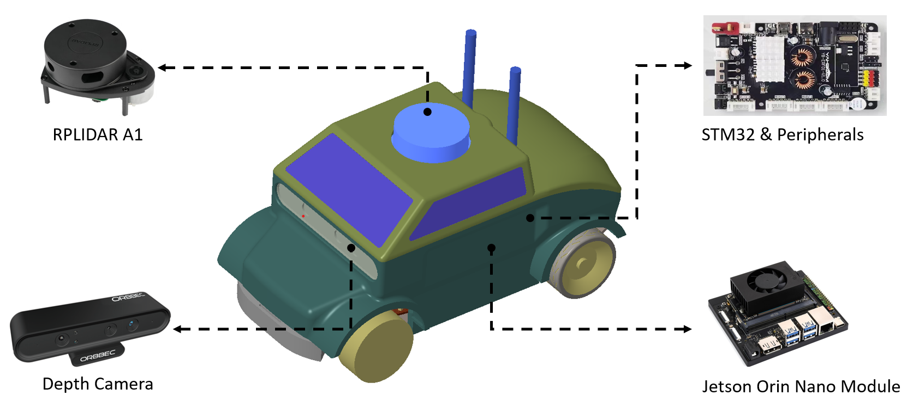

# Real Robot

{: .center-image width="80%"}

*Hardware of the real-world car-like robot*
{: .text-center}

To validate ISS algorithms in real-world scenarios, a car-like robot can be employed. For detailed information and guidelines, please consult our detailed [documentation](https://isspa.readthedocs.io/).
