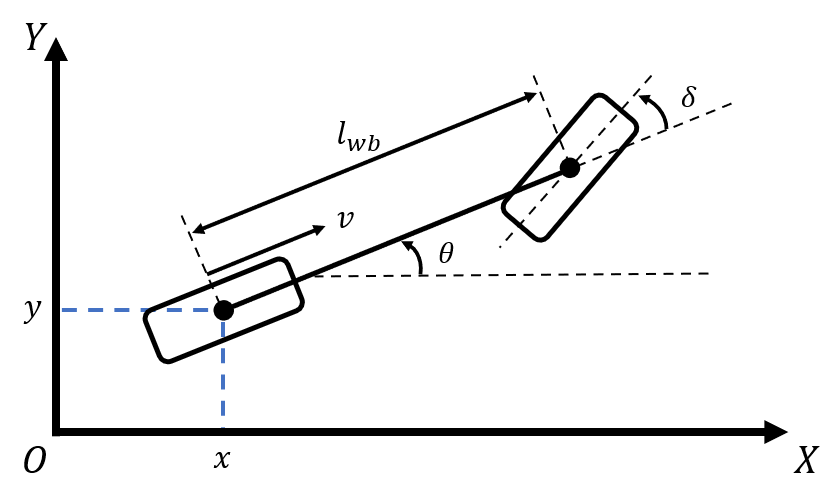
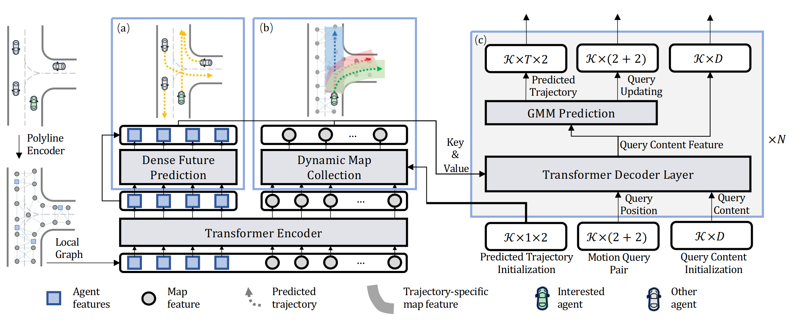

# Prediction

## Introduction to the Prediction Module

Prediction plays a pivotal role in autonomous driving, determining the probable actions of on-road agents to ensure safe navigation. 
In this documentation, we outline our current methodologies, from the simple [constant velocity motion](#CVM) predictor to the more advanced [Motion Transformer](#MT).

## Constant Velocity Motion Predictor<a name="CVM"/>

### Overview
The constant velocity model is the most basic but effective method of prediction<a href="#ref1">[1]</a>, assuming an entity continues its current trajectory at a constant speed. 
Here, we forward simulate the kinematic bicycle model via the Runge-Kutta 4 (RK4) integration, assuming no acceleration and steering angle.

### Applicability and Limitations
- **Applicability**: ideal for high-speed highways where motion is relatively linear.
- **Limitations**: in urban or crowded areas, this model may not capture erratic movements of the agents.

### Mathematical Model
{: .center-image width="50%"}

*Kinematic bicycle model*
{: .text-center}

The primary equations governing the kinematic bicycle model are:

1. **Position updates**: the spatial coordinates of the vehicle rear wheel are updated from time $$ t $$ to time $$ t + 1 $$ as  
   
    $$ x(t+1) = x(t) + v(t) \cos(\theta(t)) \Delta t $$

    $$ y(t+1) = y(t) + v(t) \sin(\theta(t)) \Delta t $$

2. **Heading update**: the heading of the bicycle changes as
   
    $$ \theta(t+1) = \theta(t) + \frac{v(t)}{l_{wb}} \tan(\delta) \Delta t $$

where
- $$ (x, y) $$ represents the vehicle's position;
- $$ \theta $$ is the vehicle's heading;
- $$ v $$ denotes the vehicle's velocity;
- $$ \delta $$ is the steering angle at the front wheel;
- $$ l_{wb} $$ is the wheelbase, i.e., the distance between the front and rear axles; and
- $$ \Delta t $$ is the time step.

The RK4 method is then applied for forward simulation to improve prediction accuracy over short horizons.

### Sample Use Cases
- Highways and expressways.
- Open areas with minimal obstructions.

In ISS, the constant velocity model is incorporated for motion forecasting in the structured road environment.

## Motion Transformer<a name="MT"/>

### Overview
The Motion Transformer<a href="#ref2">[2]</a> is a state-of-the-art model that considers historical data to predict future trajectories. This framework models the motion prediction as a joint optimization of global intention localization and local movement refinement. Apart from considering the global information of the road structures, this method also incorporates different motion modes by adapting learnable motion queries. The overal structure of the Motion Transformer is shown in the figure below.

{: .center-image }

*The structure of the motion transformer<a href="#ref2">[2]</a>*
{: .text-center}

### Why Motion Transformer?
Simpler models lack the nuance needed for complex environments. 
The Motion Transformer accounts for historical trajectories, giving it an edge in intricate scenarios.

### Architecture & Components
- **Attention Mechanisms**: to weigh the importance of different historical data points.
- **Encoder-Decoder Structures**: the encoder processes the input sequence, while the decoder produces the predicted trajectory.

### Input/Output Details
- **Input**: historical trajectory data.
- **Output**: predicted future trajectories with confidence intervals.

## Implementation Roadmap
1. Maintain the existing constant velocity motion predictor to ensure basic functionality.
2. Understand and set up the Motion Transformer's neural network.
3. Collect and process datasets and conduct training and simulation tests.
4. Integrate into the current pipeline and ensure ongoing model optimization.

## References
<ol>
    <li id="ref1">Schöller C, Aravantinos V, Lay F, et al. "What the constant velocity model can teach us about pedestrian motion prediction." In IEEE Robotics and Automation Letters, 2020, 5(2): 1696-1703.</li>
    <li id="ref2">Shi S, Jiang L, Dai D, et al. "Motion transformer with global intention localization and local movement refinement." In Advances in Neural Information Processing Systems, 2022, 35: 6531-6543.</li>
</ol>
