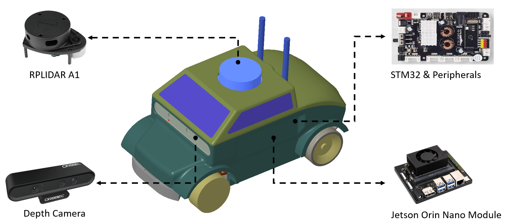

# Real Robot Platform

## Hardware Introduction

{: .center-image width="80%"}

*Hardware of the real-world car-like robot*
{: .text-center}

### Key Components for Research

Our platform is equipped with advanced hardware tailored for research in autonomous driving and sim-to-real transfer, making it a valuable tool for testing algorithms in real-world scenarios.

#### 2D LiDAR
- **Functionality:** Provides precise spatial mapping and real-time obstacle detection, crucial for autonomous vehicle navigation.
- **Research Applications:** Suitable for SLAM research, and testing navigation and avoidance algorithms in real-world settings.

#### Depth Camera
- **Capabilities:** Offers 3D imaging for detailed environmental perception and object recognition.
- **Research Implications:** Useful for depth perception studies, 3D environment reconstruction, and validating simulation models against physical environments.

#### Jetson Nano Module
- **Processing Power:** Delivers the necessary computational capacity for on-board processing of complex algorithms.
- **Research Utility:** Ideal for running advanced machine learning models and real-time data processing essential in autonomous driving research.

#### STM32 Board with Peripherals
- **Control System:** Manages integration of sensors and actuators, ensuring responsive operation.
- **Research Opportunities:** Enables experimentation with embedded systems, control algorithms, and hardware-software interaction.

## Software Introduction

### ROS1: A Robust Framework for Robotics Research

#### Core Attributes
- **Framework Overview:** ROS1 offers a versatile architecture, essential for developing and testing autonomous driving systems.
- **Research Compatibility:** Supports rapid prototyping, essential for iterative development and testing in autonomous driving research.

#### Navigation Stack
- **Components:** Includes tools for advanced path planning, localization, obstacle avoidance, and SLAM.
- **Autonomous Navigation:** Equipped for sophisticated navigation algorithms, allowing the robot to navigate autonomously in complex environments.
- **SLAM and Localization:** Utilizes ROS packages like `gmapping` for efficient map creation and accurate localization, crucial for autonomous vehicle operations.
- **Research Relevance:** Facilitates testing and refinement of autonomous driving algorithms under real-world conditions.

#### Sensor Data Integration and Analysis
- **Integration Proficiency:** Combines data from multiple sensors for comprehensive environmental understanding.
- **Research Advantages:** Supports investigations into sensor fusion, real-world data analytics, and environment-aware decision-making.

